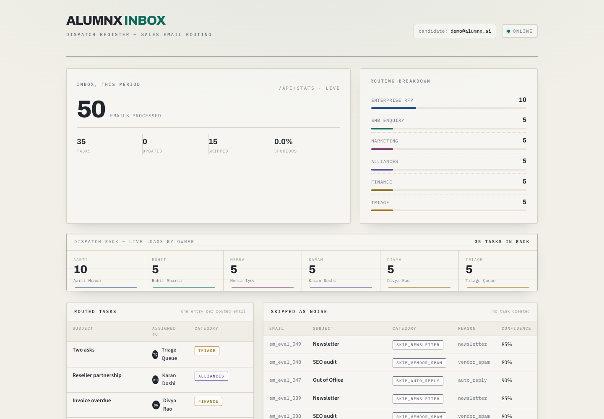
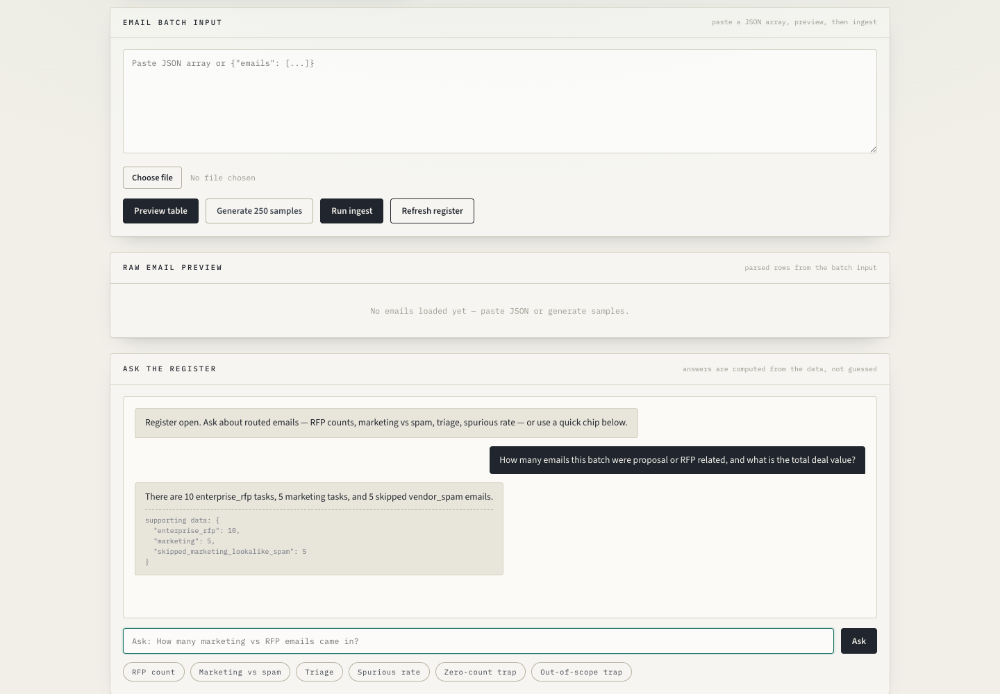

# DispatchDesk — Sales Inbox Router

**Turns a chaotic 150–250-email-a-day sales inbox into a clean dispatch register — in under a minute.**

DispatchDesk reads incoming sales emails, classifies each one (RFP, SMB enquiry, marketing, alliances, finance, or triage), **skips the noise** (out-of-office, newsletters, vendor spam), routes every task to the right team member, and lets your ops lead ask questions about the data in plain English.

No LLM API key required — it runs in **deterministic fallback mode** out of the box and upgrades to Gemini extraction when you add a key.

[](https://render.com/deploy?repo=https://github.com/VivekGitNinja/dispatchdesk-sales-inbox-router)

---

## Try it — two ways

**Option A — one command locally (Docker):**

```bash
docker compose up --build
# open http://localhost:8000
```

**Option B — deploy to Render (free tier, ~2 minutes):**

1. Click the **Deploy to Render** button above (uses `render.yaml`).
2. When the service is live, seed a demo inbox so the register isn't empty:

```bash
API_BASE=https://your-app.onrender.com python scripts/seed_demo.py
```

That's it. No `GEMINI_API_KEY` needed — the app ships with a working deterministic router. Add a key later to unlock LLM extraction for messier emails.

> **Demo data:** `python scripts/seed_demo.py` loads 50 realistic emails (RFPs, PSU tenders, demos, sponsorships, invoices, partnerships, spam, newsletters, multi-intent requests) so you can play with a fully-populated register immediately.

---

## Screenshots

| Live register (routed tasks, rack, stats) | Grounded chat answers |
|---|---|
|  |  |

> Screenshots are captured from a real run (fallback mode, seeded demo inbox). Full-page view: [docs/screenshots/full.png](docs/screenshots/full.png).

---

## For sales operations teams (no code needed)

**The problem:** sales email arrives in one shared inbox. Someone has to read every message, decide what it is, and forward it to the right person. By Friday, 200+ emails sit unread, and that big ₹25-lakh RFP is buried under a webinar invitation.

**What DispatchDesk does for you:**

- **Classifies every email** into 6 categories and routes it to the right owner — enterprise RFPs go to Aarti, SMB demos to Rohit, sponsorships to Meera, partnerships to Karan, invoices to Divya, ambiguous stuff to a human triage queue.
- **Filters the noise automatically** — out-of-office auto-replies, newsletters, and vendor spam are skipped and logged, never routed.
- **Enforces your business rules** — deals above ₹10,00,000 go to enterprise sales, government/PSU tenders always go to the enterprise lead, urgent deadlines and overdue invoices get bumped to high priority.
- **Keeps threads together** — a reply on an existing thread updates the same task instead of creating a duplicate.
- **Answers questions from real data** — ask "How many RFPs came in this batch?" or "What's our spurious rate?" and get numbers computed from the database, not guessed by a chatbot.

**How you'd use it day-to-day:** the register shows every routed task with assignee, category, priority, deal value, and confidence. The chat panel answers analytics questions. No training, no setup per user — it just works on the shared inbox.

---

## For developers (how it works)

### Architecture

```
┌─────────────┐      POST /ingest       ┌──────────────────────┐
│  Frontend    │ ───────────────────────→│  FastAPI Backend     │
│  (index.html)│                         │  ┌──────────────────┐│
│              │      GET /api/tasks     │  │ Gemini 1.5 Flash ││
│              │ ←───────────────────────│  │ (LLM classifier) ││
│              │                         │  └──────────────────┘│
│              │      POST /api/chat     │  ┌──────────────────┐│
│              │ ───────────────────────→│  │ Rules Engine     ││
│              │                         │  │ (deterministic)  ││
└─────────────┘                         │  └──────────────────┘│
                                        │  ┌──────────────────┐│
                                        │  │ SQLite / Postgres ││
                                        │  │ (persistent)     ││
                                        │  └──────────────────┘│
                                        └──────────────────────┘
```

### The pipeline (modules: [schemas.py](backend/schemas.py) · [rules_engine.py](backend/rules_engine.py) · [chat_rag.py](backend/chat_rag.py) · [app.py](backend/app.py))

1. **Gemini proposes** — `analyze_email` → `gemini_json` extracts category, deal value, due date, confidence, and reasoning from the email. If no `GEMINI_API_KEY` is set or the API fails, a **deterministic keyword router** (`fallback_analyze`) handles it instead — **the system never drops an email**.
2. **Rules decide** — `apply_rules` always runs after extraction. It enforces the ₹10,00,000 threshold, overrides government/PSU tenders to the enterprise lead, derives the assignee from the final category (never trusting the LLM's own assignee), and escalates urgent deadlines / overdue invoices to high priority.
3. **Multi-intent emails go to triage** — two or more distinct asks (e.g. "evaluate your platform AND co-host a webinar") are routed to a human triage queue as a single task.
4. **Chat is SQL-grounded** — `/api/chat` computes answers from the database first; Gemini (when present) only re-phrases the answer. **Numbers cannot hallucinate.**

### Why this design

- **LLM proposes, rules dispose.** The LLM handles ambiguity; hard business rules guarantee deterministic outcomes that are auditable and testable.
- **Fallback-first.** The eval suite and the demo both run without a Gemini key, so the core product is verifiable anywhere.
- **Grounded chat.** Every answer carries `supporting_data` — the actual counts the answer was built from. See [DECISIONS.md](DECISIONS.md) for the full tradeoff log.

---

## Verified results (eval, fallback mode, fresh DB)

| Metric | Value |
|--------|-------|
| Precision / Recall / F1 | 1.0000 |
| Category accuracy | 1.0000 |
| Assignee accuracy | 1.0000 |
| Idempotency (re-ingest same batch) | PASS (0 new tasks, 0 updates) |
| Thread reconciliation (reply updates, not creates) | PASS |
| Chat tests | 6/6 |

Routing accuracy is a **hard gate** in the eval (`>= 0.95` on category and assignee) — F1 alone cannot see tasks routed to the wrong person. Methodology, history, and honest limitations: [EVALS.md](EVALS.md).

---

## Quick start (no Docker)

```bash
# 1. Clone and enter
git clone https://github.com/VivekGitNinja/dispatchdesk-sales-inbox-router
cd dispatchdesk-sales-inbox-router

# 2. Python env + deps
python3 -m venv venv
source venv/bin/activate
pip install -r backend/requirements.txt

# 3. (Optional) Gemini key — skip this and it still works in fallback mode
cp .env.example .env   # add GEMINI_API_KEY if you want LLM extraction

# 4. Run
uvicorn app:app --app-dir backend --host 0.0.0.0 --port 8000 --reload

# 5. Seed a demo inbox and open the UI
python scripts/seed_demo.py
open http://localhost:8000
```

## candidate_id — a tenant, not a person

The old README hardcoded a personal email (`priya.sharma@gmail.com`) as the candidate identifier. That's gone. `candidate_id` is now just a **workspace/tenant key**:

- Default: `demo@dispatchdesk.ai` (any string works — it doesn't have to be a real email)
- Override per deployment: `CANDIDATE_ID` env var
- Override per browser: set it in the footer of the UI, or pass `?candidate=your-workspace` in the URL

Each candidate_id gets its own isolated task/email namespace, so one deployment can serve many teams.

## Environment variables

| Variable | Required | Default | Description |
|----------|----------|---------|-------------|
| `GEMINI_API_KEY` | No* | — | Google AI API key. *Works without it — deterministic fallback router. |
| `DATABASE_URL` | No | `sqlite:///...` | Postgres connection string for production |
| `CANDIDATE_ID` | No | `demo@dispatchdesk.ai` | Tenant/workspace identifier |
| `GEMINI_MODEL` | No | `gemini-1.5-flash` | Gemini model to use |
| `API_TOKEN` | No | — | Optional bearer token protecting all data endpoints |
| `PGSSLMODE` | No | `require` | SSL mode for Postgres |

## API

| Method | Path | Description |
|--------|------|-------------|
| `POST` | `/ingest` | Ingest a batch of emails → routed/skipped/updated (max 100/batch) |
| `GET` | `/api/tasks` | Routed tasks + skipped emails for the UI |
| `GET` | `/api/stats` | Routing statistics (counts by category, skip reason, batch) |
| `POST` | `/api/chat` | Ask questions; answers computed from stored data |
| `POST` | `/tasks` | Create a task (validated API) |
| `GET` | `/tasks` | List tasks (requires `candidate_id`) |
| `PATCH` | `/tasks/{task_id}` | Update a task |
| `DELETE` | `/tasks/{task_id}` | Delete a task |
| `GET` | `/users` | List team members |
| `GET` | `/health` | Health check |
| `GET` | `/docs` | Interactive OpenAPI docs (FastAPI) |

## Deployment

- **Backend (Render):** `render.yaml` is ready — the Deploy to Render button handles it. Set `GEMINI_API_KEY` and `DATABASE_URL` as env vars (optional for demo; recommended for production). Free-tier PostgreSQL works.
- **Frontend (Netlify):** deploy the `frontend/` folder (`netlify.toml` included) and set the API base in the UI footer. Note: the backend already serves the UI at `/` — separate frontend hosting is optional.
- **Auth:** set `API_TOKEN` and all data endpoints require `Authorization: Bearer <token>`. The UI has a token field in the footer.
- **CI:** [.github/workflows/ci.yml](.github/workflows/ci.yml) runs unit tests + the full gated eval on every push/PR against a fresh database.

## Testing

```bash
source venv/bin/activate

# Unit tests (parsers, fallback routing, rules) — no server needed
python -m pytest tests/ -v

# Full eval: routing accuracy + idempotency + thread reconciliation + chat
# (starts against a running server; use a fresh DB for clean results)
rm -f backend/inbox_router.db
DATABASE_URL="sqlite:///./fresh.db" uvicorn app:app --app-dir backend --host 0.0.0.0 --port 8000 &
API_BASE=http://localhost:8000 python scripts/run_eval.py
cat evals/results.json   # overall_passed must be true
```

## Project structure

```
dispatchdesk-sales-inbox-router/
├── backend/
│   ├── app.py               # FastAPI entry point (endpoints + middleware only)
│   ├── schemas.py           # Pydantic v2 models, enums, taxonomy, validation
│   ├── db.py                # SQLAlchemy engine, models, serializers, roster
│   ├── rules_engine.py      # Cleaning, extraction, fallback router, rules, roles, Gemini
│   ├── chat_rag.py          # Grounded analytics chat (SQL-first, Gemini phrases)
│   └── requirements.txt
├── frontend/
│   └── index.html           # Dispatch-register UI (served by backend at /)
├── scripts/
│   ├── seed_demo.py         # One command → populated demo inbox
│   ├── make_eval_dataset.py # Generate the 50-email labeled eval dataset
│   └── run_eval.py          # 3 grading runs + chat tests (gated)
├── tests/                   # pytest: parsers, fallback routing, rules, schema layer
├── evals/                   # dataset.json + results.json
├── docs/screenshots/        # Proof-it-works captures
├── Dockerfile               # Single container: API + UI
├── docker-compose.yml       # `docker compose up --build` → done
├── .github/workflows/ci.yml # Unit tests + gated eval on push/PR
├── render.yaml              # One-click Render deploy
├── DECISIONS.md             # 6 tradeoffs with reasoning
├── EVALS.md                 # Methodology, history, honest limitations
└── README.md
```

## Docs

- [EVALS.md](EVALS.md) — evaluation methodology, change history, known limitations
- [DECISIONS.md](DECISIONS.md) — tradeoffs (fallback router, grounded chat, triage for multi-intent, etc.)
- [TEST_PLAN.md](TEST_PLAN.md) — QA plan
- [GAP_AUDIT.md](GAP_AUDIT.md) — original gap audit and how each item was resolved
- [VALIDATION_REPORT.md](VALIDATION_REPORT.md) — validation checklist
- [PRD](prd.md) — product requirements

## Roadmap (ideas welcome)

- Gmail/Outlook connector (push-based ingestion instead of paste/upload)
- Reply drafting with human-in-the-loop approval
- Slack/email notifications when a task hits triage
- Per-team routing rules as config (YAML), not code
